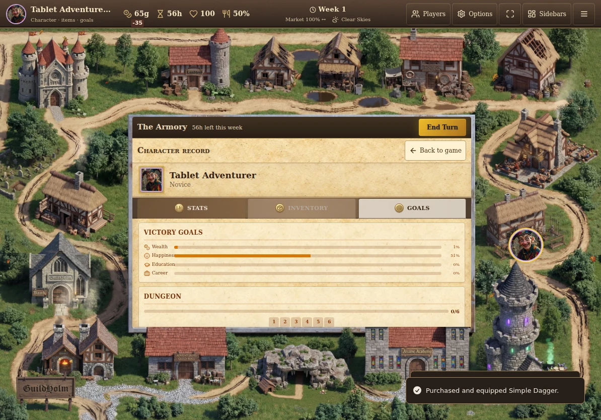
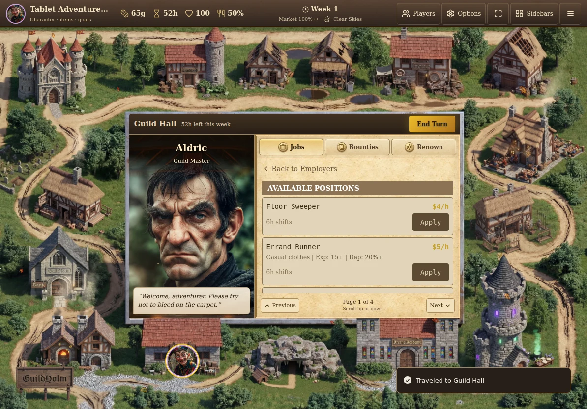
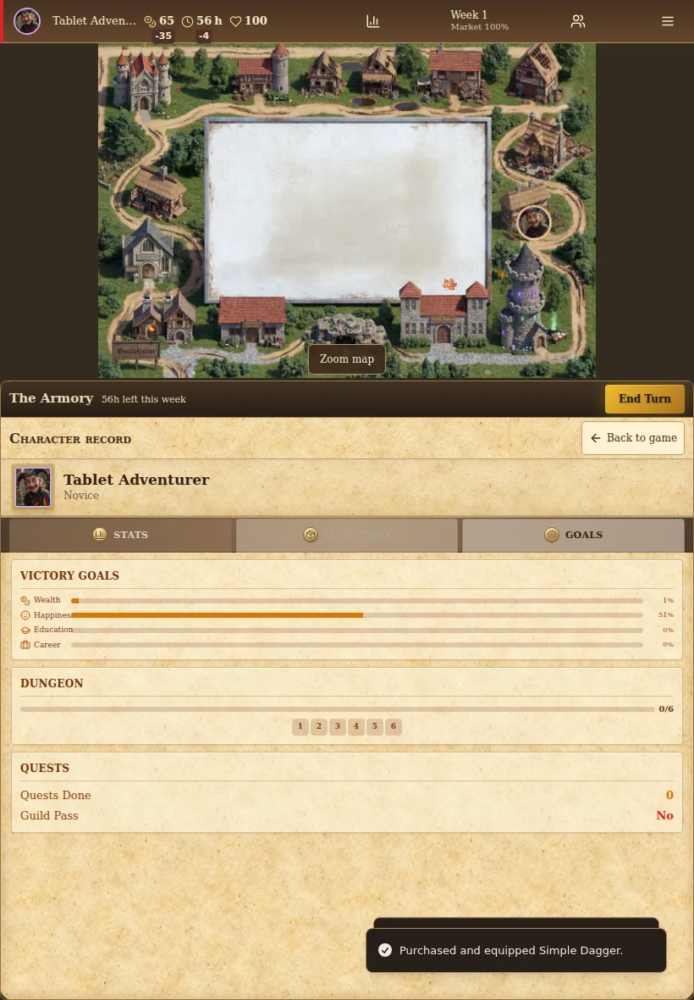
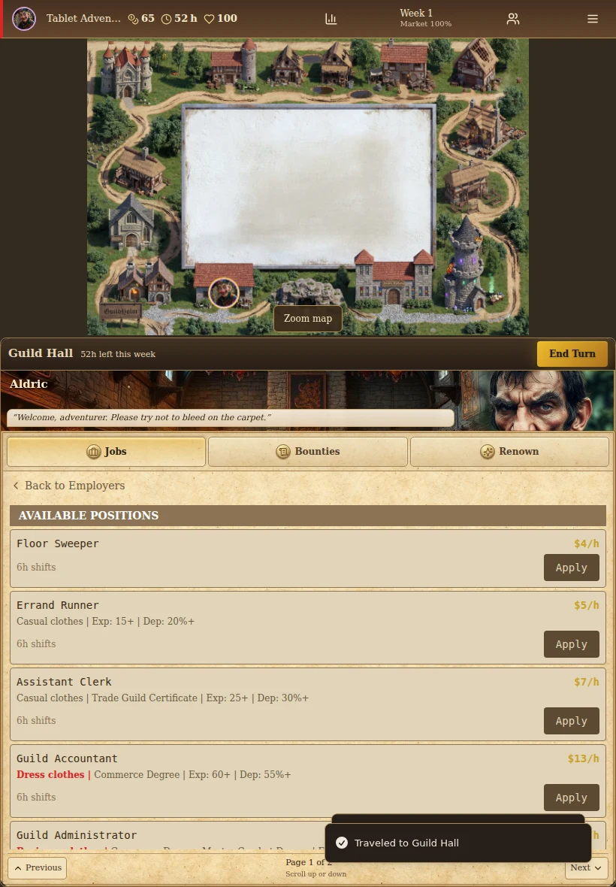

# Center panel, touch scrolling and token movement — 2026-09-08

Base: `90186564d862e92483d95829511bff74c6e73386` (main, PR #414).

The reported problems were a Character Record floating above the central panel,
job lists that would only move sideways on touch, and stuttering token movement.

## Changes

| Report | Cause and correction | Verification |
| --- | --- | --- |
| Character Record outside the panel | Replaced the modal with `CharacterPanel` inside `GameBoardCenterPanel`. Stats, Inventory and Goals reuse the existing live sidebar content. | Native tablet tests assert the record is bounded by the existing panel and that no dialog opens. Back/Escape restores the underlying service and reading position. |
| Vertical touch scrolling blocked | The list used horizontal CSS columns, translated pages and a custom swipe handler. Replaced this with a native vertical scrollport and a drag-to-click guard. | Native touch swipes in both directions change job-list scroll position at 1194×834 and 820×1180. A drag cannot buy an item; a subsequent tap can. Previous/Next, tabs and fixed encounter actions remain available. |
| Movement rendering overhead | Waypoints triggered React updates plus left/top transitions. Movement now interpolates the same path with a transform-only animation frame loop, cached board dimensions and boundary callbacks. | Unit tests cover callback order, delayed frames, cancellation and absence of React commits during frames. Browser tests verify actual arrival at Guild Hall, Bank and Armory. |

The atmospheric renderer now stays registered across ordinary board renders (and refreshes when saved
animation layers change),
paints at most 30 times per second, and avoids an empty screen canvas in clear
weather. Protected-panel measurements are coalesced and no longer follow token
transitions or inner-list scrolling. Token movement keeps its separate display
refresh clock. Board art, routes, movement charges and authoritative store actions
are unchanged.

The character view yields to game events. The location remains mounted while the
record is shown; inner employer/offer navigation explicitly resets reading position.
The existing portrait layout uses its action area below the map, while landscape
uses the board's central frame.

## Validation

- Production build: passed.
- Unit suite: 768 tests passed across 102 files; 25 relevant tests were rerun
  after connecting the saved animation-layer refresh and passed again.
- ESLint: zero errors, 27 existing warnings.
- Configured `tsc --noEmit`: passed. The extended app configuration still reports
  185 diagnostics; none concern changed files. See the evidence summary for the
  comparison with the base revision.
- Fourteen relevant browser scenarios passed across staged runs: keyboard/modal
  controls, phone/tablet layout, display persistence, native touch and character
  navigation, movement, three equipment sizes, market services, cave flow and
  deployed-update recovery. The final four-scenario touch/movement run passed
  without retries. This was not a single clean fourteen-test invocation: the
  initial portrait test exposed a setup race, fixed by waiting for the board's
  keyboard handler before exiting fullscreen. The native touch checks then passed.
- Screenshots were visually inspected. Browser verification used Chromium touch
  emulation; physical iPad/Safari behavior and sustained hardware frame rate remain
  unverified.

Run the repository checks with `bun run test`, `bun run lint`, `bun run build`,
`bunx tsc --noEmit`, and `bun run test:e2e`. The movement browser test writes its
metrics to the Playwright output directory. For the comparison, the same harness
was run against the base worktree with `MOVEMENT_BASELINE=1` (only the new inline
transform assertion is skipped in that mode).

## Local performance comparison

One base three-trip sample and the last candidate three-trip sample, same Chromium runtime, 1194×834,
deterministic fresh game and assets loaded before measurement. The interval
includes clicking the destination, travel and rendering the arrival panel. These
are local browser work measurements, not an iPad FPS or universal speedup claim.

| Across three trips | Base | Final candidate |
| --- | ---: | ---: |
| Layout operations | 123 | 21 |
| JavaScript time | 2,219 ms | 971 ms |
| Browser task time | 3,006 ms | 1,634 ms |

Raw samples and test outcomes: [evidence](qa/center-touch/evidence.json).

## Visual evidence

Character Record inside the landscape center panel:

Guild Hall after scrolling down and back up:

Portrait checks:

