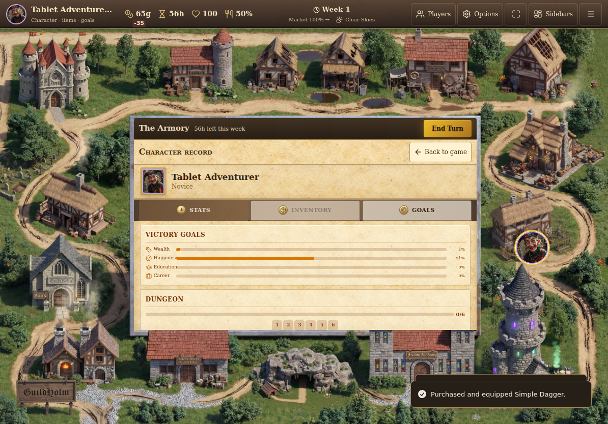
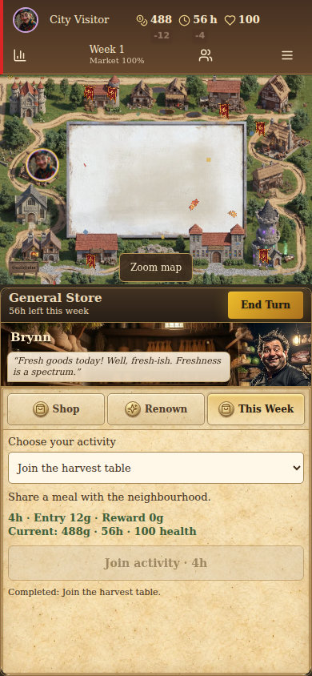

# Gauntlet code cleanup — 2026-09-08

Base: `12bc383177e60b4a57d61ab3af26faa5f0147119` (main, PR #415).

## Acceptance criteria

1. Remove only code with no application, test, build, script or server consumer.
2. Preserve the board, tokens, inline character record, native touch scrolling,
   AI actions, saves and host-authoritative multiplayer.
3. Make the published TypeScript command check the actual app and build config.
4. Reduce unnecessary subscriptions/dependencies and record measurements.
5. Inspect every open PR; distinguish unused dependencies from relevant upgrades.

## Changes and evidence

| Observation | Correction | Check |
| --- | --- | --- |
| 50 source files were unreachable from the app entry point and tests, including obsolete panels and unused UI scaffolding. | Removed 49 unreachable TS/TSX modules plus the unimported starter App.css after resolving both static and literal dynamic imports and checking non-app consumers. | Build, typecheck and import-graph scan; [removal inventory](qa/code-cleanup/removed-code.json). |
| React Query had a root provider but no consumers; other direct dependencies served only removed scaffold files or had no imports. | Removed the provider and 33 direct dependencies. Regenerated `bun.lock` using pinned Bun and performed an isolated frozen install. | Retained direct dependency versions stay unchanged. PartySocket/PartyKit remain for the world leaderboard; MQTT remains for public rooms. |
| `tsc --noEmit` selected a solution config with no source files and silently missed 185 diagnostics. | Check both app and node projects explicitly. Use `undefined` for forwarded guest results, correct the festival import and valid degree fixtures. | Both real TypeScript projects pass, with no exclusions or suppressed errors added. |
| AI action signatures and selected references had drifted, including removed eight-week rent and legacy sale references. | One `selectAIStoreActions` definition supplies the consumed methods and derives `StoreActions` from the canonical store. | Typecheck, semantic AI tests and seeded balance run. |
| 15 hooks/components subscribed to the entire game store. | Select the consumed values/actions with shallow equality; memoize resource/weekly/goal summaries. | Goal display regression measures React commits on unrelated board changes and still checks live stock-price updates. |
| Tutorial checked an `isSpectating` field that does not exist in the store. | Reuse the board's audience derivation, including eliminated players. | Real-state spectator regression. |

## Local build measurements

Same Bun 1.3.14, Vite 5.4.19, production build, no asset quality reduction.

| Measure | Base | Candidate |
| --- | ---: | ---: |
| JavaScript across emitted chunks | 2,737,236 bytes | 2,711,969 bytes |
| CSS across emitted chunks | 178,050 bytes | 149,418 bytes |
| App chunk (gzip) | 277,883 bytes | 270,291 bytes |
| TypeScript diagnostics in app project | 185 | 0 |
| ESLint errors / warnings | 0 / 27 | 0 / 19 |

These are byte counts and local browser/React measurements, not a claim of a
particular frame rate on an iPad or other physical device.

## Open PR audit

GitHub returned eleven open PRs. All were authored by Dependabot; the recent
game/UI implementation PRs through #415 are already merged. Each patch was read.

| PR | Verdict | Reason |
| --- | --- | --- |
| #389 — react-toggle | Superseded by this cleanup | Its only consumers were unused toggle/toggle-group scaffold components. |
| #385 — react-alert-dialog | Superseded by this cleanup | The alert-dialog scaffold had no app or test consumer. The active game uses react-dialog, which stays. |
| #384 — react-collection | Superseded as a direct dependency update | No direct imports. It still legitimately occurs transitively under active Radix components; do not remove those lock entries by hand. |
| #387 — react-toast | Still relevant | Active toaster and hook use it. |
| #386 — sharp | Still relevant | Used by `scripts/generate-icons.mjs`. |
| #388 — Vite 5 → 8 | Still relevant; separate migration | A major build-tool change needs plugin/PWA/build verification. It is not obsolete simply because it is old. |
| #379 — upload-pages-artifact | Still relevant | Used by the Pages deployment workflow. |
| #380 — checkout | Still relevant | Used by both validation and deployment. |
| #381 — deploy-pages | Still relevant | Publishes the Pages artifact. |
| #382 — configure-pages | Still relevant | Configures the Pages deployment. |
| #383 — upload-artifact | Still relevant; refresh patch first | Used by validation. Its old patch predates the new balance/runtime-screenshot upload steps and does not update every current use. |

## Verification status

| Gate | Result | Evidence |
| --- | --- | --- |
| Required behavior | PASS | All 39 browser scenarios passed in one run, without retries: onboarding, save/load, bank/shops, touch, multiplayer/rejoin/rejections, cave and update recovery. |
| Visual preservation | PASS | Runtime captures inspected at tablet and phone sizes; original board, characters and center-panel composition remain. |
| Dependencies and types | PASS | Isolated frozen Bun install; real app and node TypeScript projects both pass. No source exclusions or type-error suppressions added. |
| Regressions | PASS | 770 tests across 103 files; both new regressions fail on the base and pass on the candidate. ESLint: 0 errors, 19 existing warnings. |
| AI behavior | PASS | Three complete games per build, same seeds: full gameplay reports match exactly except their source commit. No runtime errors. |
| Audio | PASS | 42 files, zero silent/invalid files and zero exact duplicate groups. |
| Build/render work | PASS | Production build; byte counts above; goal display performs 0 rather than 3 React commits on three unrelated location selections and still updates once for a stock-price change. |
| Physical device 60 fps | UNVERIFIED | Chromium headless measurements cannot establish physical iPad/Safari frame rate. |
| GitHub delivery | BLOCKED | Automatic approval review rejected the push because it requires explicit authorization to publish the new branch. No remote branch or PR was created and no old PR was closed. |

### Movement comparison

Three sequential production-browser runs per build, each visiting Guild Hall,
Bank and Armory at 1194×834 with a fixed RNG. Other validation jobs had finished.
Median totals across each three-trip run:

| Measure | Base | Candidate |
| --- | ---: | ---: |
| Layout operations | 21 | 22 |
| Style recalculations | 231 | 248 |
| Layout time | 27.7 ms | 26.4 ms |
| JavaScript time | 981.3 ms | 966.4 ms |
| Browser task time | 1,610.3 ms | 1,573.9 ms |

These samples do **not** establish a material movement speedup. The earlier
single candidate sample overlapped a TypeScript check and was slower; it is
recorded in the evidence rather than presented as a clean comparison. The
measured improvements are smaller bundles and avoided unrelated React renders.

An initial local test server was unreachable across isolated tool sessions;
rerunning with the server owned by Playwright passed. This was an environment
setup failure. All 39 final integrated scenarios completed successfully.

The tested runtime code is commit `42707ee`. The follow-up removes only the
unreferenced starter stylesheet and records evidence. The stylesheet is not
part of either emitted production build.

### Reviewable output

- [Full evidence and raw movement samples](qa/code-cleanup/evidence.json)
- [Prepared pull-request description](qa/code-cleanup/PULL_REQUEST.md)
- [All eleven PR patches reviewed](qa/code-cleanup/pr-audit.json)
- [Browser results](qa/code-cleanup/browser-validation.txt)
- [Baseline AI report](qa/code-cleanup/balance-baseline.json) and [candidate AI report](qa/code-cleanup/balance-candidate.json)

