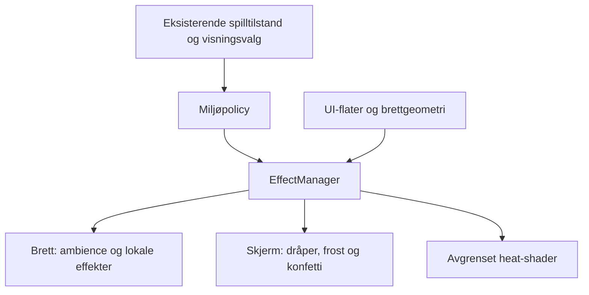

# Guild Life — teknisk plan for VFX, ikoner og sidepanelgrafikk

Dato: 7. september 2026. Kildegrunnlag: `main` ved `693ca1500e4f04b80b2c855f3bc5e68bb39928a9`, merge av PR #408.

Oppdatert 8. september: Implementeringen er levert i [PR #410](https://github.com/Tombonator3000/guild-life-adventures/pull/410). Se [verifiserte spillbilder og tester](../qa/board-vfx/README.md) og [implementeringsloggen](../AUDIT_LOG_BOARD_VFX_IMPLEMENTATION.md). Resten av dette dokumentet beskriver planens opprinnelige grunnlag.

**Leveransen her er en implementeringsplan. De nye effektene er ikke implementert eller ytelsesmålt i denne endringen.** Planen følger eierens siste arbeidsordre og viderefører [Classic Visual Direction](CLASSIC_VISUAL_DIRECTION.md). Tidligere forslag om et annet kart, realistiske erstatningsportretter eller ny UI-struktur gjelder ikke denne oppgaven.

## 1. Fast mål og fem akseptkrav

Samme spillbrett, bygninger, karikaturfigurer, tokens, reiseruter, sentralramme og panelstruktur. Et rikere atmosfærelag legges oppå den eksisterende illustrasjonen. Ikoner og panelmaterialer får detaljene fra referansebildene innenfor dagens komponenter.

1. **Identitet:** Originalbrett og figurressurser er uendret. Ingen flyttede lokasjoner, ny kameravinkel, endrede klikksoner eller ombygd navigasjon.
2. **Synlig løft:** Røyk, løv, skypass, fugler og magisk lys har tydelig tekstur, variasjon og dybde i faktisk spill. Fargede ellipser alene oppfyller ikke dette.
3. **Eventforskjeller:** Tørke gir varmeforvrengning og støv; regn gir nedbør, glidende skjermdråper og lokale våte partier; snø gir tre dybdelag og kantfrost; turnering gir konfetti og lokal pynt.
4. **Brukbarhet:** Work, Bank, Cave, End Turn, modaler og mobilskuffer fungerer og er lesbare. Full/Calm/Off, redusert bevegelse og skjult fane styrer alle nye effekter. Eksisterende lokasjonsmenyer beholder sidene og de samlede faneradene fra PR #408.
5. **Bevis:** Hver leveranse får ekte skjermopptak/bilder og relevante regresjonskontroller på samme revisjon. 60 fps er et mål som må måles; mobil viewport er ikke et bevis på ytelse på Samsung S24.

## 2. Hva som faktisk finnes i repoet

Alle stier i tabellen under finnes ved grunnlagsrevisjonen. Beskrivelsene bygger på kodegjennomgang, ikke en ny kjøring av spillet.

| Eksisterende fil/system | Observert | Videre bruk |
| --- | --- | --- |
| `src/components/game/GameBoardCanvas.tsx` | DOM-komponent, til tross for navnet. Tegner `game-board.jpeg` som bakgrunn og legger miljø under klikksoner/tokens. | Behold brett og interaksjoner. Bytt miljøets innmat kontrollert. |
| `src/components/game/environment/BoardAtmosphere.tsx` | SVG-lys, røykellipser, løvbaner, svaler og gnister; faste koordinater mot bildet. | Gjenbruk ankerinformasjon; migrer effektene til teksturerte sprites. |
| `src/components/game/environment/WeatherParticles.tsx` | Canvas 2D med bufrede regn-/snøsprites, dybdevariasjon og generiske splash-punkter. | Flytt simulering og tegning inn i felles effektmotor. Masker splash til bakken. |
| `src/components/game/WeatherOverlay.tsx` og `environment/environment.css` | Værtint, mist, lyn og varm gradient/dis. Ingen faktisk heat displacement. | Gjenbruk værtilkobling og stilvalg; erstatt gradvis. |
| `src/components/game/FestivalOverlay.tsx` | Festivalteksturer og DOM-partikler for alle fire festivaler. | Flytt visuell oppførsel og brukbare assets til samme effektmotor. Ingen doble festivaler. |
| `src/components/game/GraveyardCrows.tsx` | Rasterkråker med laginnstillinger fra soneeditoren. | Behold inntil migrering viderefører synlighet, posisjon, størrelse og hastighet. |
| `src/hooks/useEnvironmentActivity.ts` | Systemets reduced motion og `document.hidden` er allerede koblet inn. | Gjenbruk. Unngå en ny parallell preferansekilde. |
| `src/data/gameOptions.ts`, `environment/EnvironmentControl.tsx` | `environmentDetail`: `full`, `reduced`, `off`. Calm er UI-navnet for `reduced`. | Behold lagringsverdiene. Vis eventuelt overskriften **Display FX** i samme kontroll. |
| `src/components/game/environment/useStorm.ts` | Sjeldne lyn og forsinket torden, med timeropprydding. | Behold én eier for lyn/torden og dagens lydinnstillinger. |
| `src/components/game/GameBoardSidePanels.tsx` | To desktop-paneler på 12 % hver; mobil bruker HUD og skuffer. | Behold bredder, plassering og responsiv flyt. |
| `src/components/game/StoneBorderFrame.tsx` | Eksisterende stone/leather/wood/iron/parchment/none-valg. Standard er `none`. | Respekter valgt ramme. Ikke tving dekorative ytterrammer på `none`. |
| `src/components/game/SideInfoTabs.tsx`, `RightSideTabs.tsx`, `LocationShell.tsx`, `ItemIcon.tsx` | Eksisterende faner, ikoner, portretter og innhold. | Gjenbruk semantikk og figurkunst; oppgrader ikoninnramming og materialer. |
| `src/assets/ui/vellum.webp`, `weather-mist.webp` | Pergament 768×768 og transparent mist 1024×342 finnes allerede. | Bruk igjen før nye materialer produseres. |

Tidligere QA: [miljø](../qa/living-guildholm/README.md), [materialer/vær](../qa/material-weather/README.md), [vinduer/Cave/oppdatering](../qa/window-cave-update/README.md). Historiske PASS-resultater dokumenterer sine revisjoner; de godkjenner ikke det planlagte VFX-systemet. Den eldre designtekstens beskrivelse av scrolling er overstyrt av PR #408s lokasjonssider.

## 3. Bildereferanser: hva vi tar med

Følgende fem konseptbilder fra 7. september er visuelt gjennomgått. De er effekt- og materialreferanser, ikke erstatninger for spillets brett eller figurer. Delingslenken `https://chatgpt.com/s/m_6a9f3d7cd2848191b52476dc4a7eba0a` kunne ikke åpnes; ingen øvrige påstander bygger på innholdet der.

| Referansefil | Ta med | Tilpass til faktisk spill |
| --- | --- | --- |
| `image-gen-1(1).png` — ambient | Myke røykfaner, brede skyggepass, varmt vinduslys, lilla tower-glow, runde ikonmedaljonger. | Bruk koordinatene fra originalbrettet, dagens portretter og eksisterende ressurser. |
| `image-gen-2(1).png` — tørke | Varmt lys, støvstriper og urolig varm luft. | Ingen nye bygninger eller uttørket erstatningskart. |
| `image-gen-3(1).png` — regn | Store, sparsomme kameradråper; regn i flere dybder; lokale refleksjoner. | Beskytt alle tekstflater; ringene skal treffe egnede bakke-/vannmasker. |
| `image-gen-4(1).png` — vinter | Fin frost ved kanter, kald luft mot varme vinduer, snø i tre dybder. | Ingen utskifting av tak, portretter eller hele kartet med vinterbilder. |
| `image-gen-5(1).png` — festival | Små flagg, vimpler, konfetti og avgrenset folkeliv. | Ingen ny arena, gateplan eller NPC-portrett med pokal. |

Det tidligere Forge-konseptet `Lærlingens skift i smia.png` er også kontrollert: den tydelige ikon-/knappbehandlingen kan brukes, mens den realistiske smeden ikke erstatter Korr.

**Vann:** Originalbrettet har ingen elv tilsvarende konseptenes. Lokale skimmer/ringer legges bare på identifiserte vann-/våte flater. Våte jordpartier ved bebyggelsen øverst kan maskeres etter nærkontroll. Det lyse steinpartiet nederst må ikke feilaktig behandles som elv. Vi tegner ikke inn en ny elv for å oppfylle effektlisten.

## 4. Valgt teknisk løsning

**Behold React/DOM. Bruk Canvas 2D til teksturerte partikler og et avgrenset WebGL-lag til varmeforvrengning.** Dette bygger på prosjektets eksisterende canvas, Vite-importer og preferanser. Ingen PixiJS eller Three.js i første implementeringsløp. Det er en arkitekturbeslutning for dette repoet, ikke en målt påstand om at andre løsninger er tregere.

Canvas kan tegne utsnitt fra spritesheets med bevart kildeformat; produksjonen bruker bufrede bilder/frames og ingen pikselavlesning per animasjonsframe. Se [MDN: drawImage](https://developer.mozilla.org/en-US/docs/Web/API/CanvasRenderingContext2D/drawImage). WebGL-delen får begrensede teksturstørrelser og eksplisitt opprydding i ressurser; se [MDN: WebGL best practices](https://developer.mozilla.org/en-US/docs/Web/API/WebGL_API/WebGL_best_practices).

### Tre logiske lag, én eier av animasjonsklokken

| Lag | Ansvar | Tegneflate |
| --- | --- | --- |
| A. World ambience | Røyk, løv, flokkbaner, brede skypass, snø og annen nedbør. | `WorldFXCanvas`, bundet til brettets størrelse. |
| B. Board-local | Forge-glød, gnister, tower-puls, vinduslys, våte partier og vannskimmer. | Samme canvas, med masker/ankre og egen tegnerekkefølge. Heat-shader ligger under denne. |
| C. Screen events | Glidende kameradråper, frost ved skjermkant, sparsomme forgrunnsflak, konfetti og mystisk vignett. | `ScreenEventFX`, bundet til spillets synlige skjermramme. |

`EnvironmentProvider` kobler én instans av `EffectManager` til begge canvas-flatene og shaderen. React oppdaterer policy når vær, festival, innstillinger eller layout endres. Partikkelposisjoner ligger i manageren, ikke i React-state.

### Montering og tegnerekkefølge

`GameBoard.tsx` får en `EnvironmentProvider` rundt eksisterende `GameBoardSidePanels`. `BoardEnvironment` erstatter innmaten i `.board-environment` i `GameBoardCanvas.tsx`. `ScreenEventFX` monteres én gang i skjermrammen i `GameBoardSidePanels.tsx`, også i fullboard og mobil.

Originalbakgrunn → heat/lokale flater → skygger/røyk/partikler → skjermdetaljer → eksisterende tokens, sonemarkeringer og UI.

Behold dagens miljø under lokasjonenes `z-[2]`, senterets `z-10` og sidepanelenes `z-30`. Animerte tokens beholder sin nåværende høyere plassering. Et barn med `z-34` inne i dagens `z-1`-miljø ligger fortsatt i forelderens stablingskontekst; tallene må ikke kopieres som globale verdier. Verifiser den faktiske stablingen etter innføring av skjermlaget, særlig ved transforms, fullscreen og portaler.

Alle FX-elementer har `pointer-events: none`, `aria-hidden` og ingen fokuserbare barn. Det er ikke nok for lesbarhet: tekstflatene må også skjermes visuelt. `useFxGeometry` måler senterpanel, HUD, sidepanelinnhold, fullboard-meny og aktive meldingsflater ved layoutendring. Disse brukes som gjennomsiktige utsparinger med litt myk avstand. Modaler, skuffer og oppdateringsvarsel ligger over effektene; forgrunnseffekter dempes/undertrykkes rundt dem. Ingen DOM-måling per frame.

### Koordinater og bildeintegritet

Original: `src/assets/game-board.jpeg`, 5056×3392. SHA-256: `fcbbcaaf3d711628a11e4b9a4d9680bf4652a467b31deda6bb1338a7c6aa6d80`.

Eksisterende atmosfære bruker 0–1000 i begge akser. Flytt dette til navngitte normaliserte ankere, for eksempel `forge.chimneyWest`, `tavern.chimney` og `enchanter.violetWindow`. Projiser `x = u × boardWidth`, `y = v × boardHeight`, og bevar spritenes egne proporsjoner. Ikke flytt røyk etter klikksonenes midtpunkter; sonene kan redigeres uten at bygningen i bildet flytter seg.

Senterets utsparing følger **aktiv** `centerPanel`, inkludert mobil- og brukeroppsett fra `useZoneConfiguration.ts`. Kråkenes eksisterende laginnstillinger videreføres særskilt. Nye ankre og masker kontrolleres mot brettbildet før de regnes som godkjente.

## 5. Filer som opprettes eller endres

Stiene merket **ny** nedenfor er forslag, ikke implementerte komponenter. Under `src/components/game/environment/`:

| Fil | Status | Oppgave |
| --- | --- | --- |
| `EnvironmentProvider.tsx` | Ny | Eier managerens livsløp, deler policy/geometri og kobler til eksisterende hooks. |
| `BoardEnvironment.tsx` | Ny | Samler brettflatene og erstatter dagens kombinasjon ved én mount. |
| `WorldFXCanvas.tsx` | Ny | Canvas 2D som registreres hos manageren; ingen egen RAF-løkke. |
| `ScreenEventFX.tsx` | Ny | Viewport-flate for frost, dråper og forgrunnseffekter; samme klokke. |
| `HeatShimmerLayer.tsx` | Ny | Avgrenset WebGL-displacement med trygg fallback og context-loss-håndtering. |
| `EffectManager.ts` | Ny | `configure`, `resize`, `start`, `pause`, `dispose`; tidssteg, pools, budsjett og tegnerekkefølge. |
| `effectPolicy.ts` | Ny | Ren avledning fra vær/festival/valg; prioritering og eksakte Full/Calm/Off-regler. |
| `effectTypes.ts` | Ny | Typer for UV-ankere, maskeregioner, emitters, teksturer og policy. |
| `boardFxAnchors.ts` | Ny | Navngitte faste bygningsankre og verifiserte lokale masker. |
| `useFxGeometry.ts` | Ny | Måler flater/utsparinger ved resize, orientering, meny- og layoutendringer. |
| `fxAssets.ts` | Ny | Vite-importer, lazy loading, atlas-frames, pivot, skalering og feilfallback. |
| `effects/ambient.ts` | Ny | Røyk, løv, fugleflokker, skyer, lys og gnister. |
| `effects/weather.ts` | Ny | Nedbør, støv, våte flater, dråper og frost. |
| `effects/celebration.ts` | Ny | Festivalpynt, konfetti og avgrenset folkeliv. |
| `shaders/heat.vert`, `shaders/heat.frag` | Nye | Shaderkilder importert med Vites råimport. |
| `environment.css` | Endres | Lag, statiske Calm-varianter og maskering. Fjern utgåtte regler etter migrering. |

Første slice trenger ikke å opprette vær-/festivalfiler som ennå ikke brukes. `BoardAtmosphere.tsx`, `WeatherParticles.tsx`, `WeatherOverlay.tsx` og `FestivalOverlay.tsx` beholdes som midlertidige adaptere bare der neste slice fortsatt trenger dem. Flytt den eksisterende nedbørens RAF-eierskap til manageren allerede i leveranse 1; leveranse 2 oppgraderer deretter selve værgrafikken. For hver effekt finnes én aktiv renderer. Eksisterende CSS-animasjoner deler pausepolicy til de migreres. Fjern adapter/import/CSS når alle brukere er flyttet; ingen evig gammel og ny motor samtidig.

Ikon-/panelsporet legger til `src/components/game/GameIcon.tsx`, `src/components/game/PanelDecoration.tsx`, `src/components/game/panel-materials.css` og `src/data/gameIcons.ts`. Integrasjon skjer i eksisterende `SideInfoTabs.tsx`, `RightSideTabs.tsx`, `MobileHUD.tsx`, `ResourcePanel.tsx` og `LocationShell.tsx`. `ItemIcon.tsx` gjenbrukes der varen allerede har riktig motiv.

## 6. Effektmanager: oppførsel og grenser

- Én RAF-klokke per aktivt brett. Effektmoduler eier ikke egne timere/RAF. Den eksisterende sjeldne lyn-/tordenplanleggingen beholdes med eksplisitt kansellering; ingen ekstra lydplanlegger.
- `pause()` kansellerer RAF. Ved synlig fane igjen nullstilles forrige tidsstempel, slik at partikler ikke hopper eller utløser et oppsamlet regn av spawns. `dispose()` fjerner observers, ressurser og avventende lasting.
- Begrens tidssteg og spawning etter treg frame. Bruk gjenbrukbare partikkelobjekter og en privat, deterministisk dekorasjonsgenerator. Aldri bruk spillets `Math.random`-strøm eller skriv visuelle verdier til gameStore, lagring av spill eller nettverksmeldinger.
- Pool-/lysstyrkebudsjett er felles for vær, ambience og festival. Storm prioriteres foran valgfritt løv/konfetti. Følg den autoritative `weather`/`activeFestival`-tilstanden; ikke rull vær eller kjør en ny konfliktløser i visningen.
- Endringer i vær/festival kan tones inn over omtrent ett sekund i Full. Gå straks til stillstand ved Calm, Off, redusert bevegelse eller skjult fane. Ingen overgang skal holde en forbudt effekt i live.
- Manglende asset stopper bare den berørte effekten. Spillet og UI fungerer fortsatt. Dette merkes som et visuelt avvik ved QA, ikke som ferdig grafikk.

| Valg/tilstand | Resultat |
| --- | --- |
| Full, synlig fane | Bevegelse, teksturer, lokale effekter og eventlag innenfor budsjett. |
| Calm (`reduced`) | Statiske lys, svak værtint og stillestående kant-/festivaldekor. Ingen løkker, kamera-displacement, fallende partikler eller lyn. |
| Off | Atmosfærelag demontert, ingen FX-RAF eller nye FX-assetlaster. Vanlig UI-materiale og ikoner beholdes. Værregler fortsetter å gjelde. |
| OS reduced motion | Høyst Calm, også når lagret valg er Full. Lagret Off forblir Off. |
| Skjult fane | Stans animasjon og avventende visuelle spawns/torden; gjenoppta rent ved retur. |

### Faktisk varmeforvrengning

`HeatShimmerLayer` prøver et lite WebGL-program som sampler **samme originale brettbilde** med en svak, tidsvarierende UV-forskyvning innenfor avgrensede maskeregioner. Dette er et transparent tillegg over originalbakgrunnen, ikke en ny scene. UI, portretter og tokens inngår ikke i teksturen.

Start med 1–2 CSS-pikslers forskyvning på varme bakkeområder; finjuster i runtime. Originalbildet må ikke lastes opp ukritisk som en ekstra 5056×3392 GPU-tekstur. Lag en nedskalert tekstur én gang, maksimalt 2048 på lengste side på desktop og 1024 på mobil, og behold samme UV-geometri. Ingen DOM-skjermdump eller pikselavlesning per frame.

Hvis WebGL ikke kan opprettes eller mister kontekst: stans shaderen, frigjør ressurser og behold støv/varmdis i Canvas. Forsøk bare kontrollert gjenoppretting. Fallback er spillbar, men **full heat-shimmer-kvalitet er ikke bestått** på en slik enhet. Regndråpenes høylys er sprites; ikke beskriv dem som fysisk brytning av hele skjermen uten at dette faktisk er implementert og verifisert.

## 7. Presis kobling mellom eksisterende events og grafikk

| Eksisterende ID | Brettlaget | Skjerm-/kantlaget |
| --- | --- | --- |
| `clear` | Lett røyk, varierte løv, sjeldne flokker, to brede skypass med ulik fart, vinduer og tower-glød. | Svært få forgrunnsløv. |
| `drought` | Støv nær bakken, hardere lys, svak varmetoning, mindre skimmer på eksisterende våte flater. | Maskert heat shimmer og tynne støvdrag. |
| `harvest-rain` | Mild regn, sparsomme dråper/ringer på bakke og våte flater. | Få glidende dråper; ingen lyn eller torden. |
| `thunderstorm` | Tettere skrått regn, mørkere skypass, våte lysreflekser, ringer, eksisterende sjeldne lyn. | Flere kameradråper; fortsatt fri tekst og spillkontroller. |
| `snowstorm` | Små fjerne, mellomstore drivende og få store nære flak; tydeligere røyk og varme vinduer. | Uregelmessig frost innenfor smale kantfelt. |
| `enchanted-fog` | Eksisterende mist med nye wisp-varianter; tower-lys og sparsomme magiske partikler. | Svak maskert vignett. |
| `harvest-festival` | Lokale gylne vimpler og innhøstingsdetaljer. | Sparsomt gyllent partikkeldryss. |
| `winter-solstice` | Eksisterende aurora-idé, stillere vinterdekor. | Svak frost/glitter; nedbør følger værtilstanden. |
| `spring-tournament` | Vimpler ved eksisterende Guild Hall/Armory-områder og små dekorative publikumsgrupper på ledig bakke. | Konfettipulser ved start og roligere dryss mellom dem. |
| `midsummer-fair` | Lanterner og streamers ved eksisterende møte-/handelssteder. | Litt konfetti og varme glimt. |

Ingen nye årstidsfelt eller kalenderregler. Vintereffekter styres av de eksisterende vær-/festivaltilstandene. Dersom senere mild årstidsvariasjon ønskes mellom festivalene, må den dokumenteres som rent visuell. Ikke kopier «Year 1, Spring 3», Mana eller Stamina fra konseptenes oppdiktede UI. Dekorative publikumsgrupper har ingen klikkflate og ligner ikke spillertokens. Eventuelle fanfarer/folkemengdeklipp bruker eksisterende lydrutere, lydvalg og dokumenterte lydkilder; musikkbytte inngår ikke her.

## 8. Ikoner og sidepanelgrafikk er del av leveransen

| Fra bildene | Implementering i dagens UI |
| --- | --- |
| Runde messingmedaljonger | `GameIcon` gir relevante eksisterende eller nye motiver en diskret metallkant, skygge og tydelig silhuett. |
| Taktile ressurssymboler | Gullmynter, timeglass, hjerte, mat, klær, bok/rull og ambolt. Samme semantiske nøkkel gjenbrukes i HUD, sidepanel og tjenester. |
| Pergamentkort og tynne skilletegn | Gjenbruk `vellum.webp`, mørkt blekk og eksisterende skriftfamilier. Rolig flate bak små tall; patina mot kantene. |
| Mørkt tre og metallhjørner | Forsterk eksisterende paneloverskrifter og valgte rammetemaer uten å endre panelmål eller `borderStyle`. |
| Fjell-/skogillustrasjon nederst til høyre | En lavkontrast bakgrunnsdekor gjennom `PanelDecoration`; ingen ny innholdsrute. Skjules når plassen trengs av kontroller/tekst, særlig på mobil. |
| Fremhevet aktiv fane | Tydelig form, lys/mørke-kontrast og bevart fokusramme. Farge alene bærer ikke tilstanden. |

Behold venstresidens Stats/Inventory/Goals og høyresidens Players/Achievements/Options, med Developer etter dagens regel. Ikke erstatt dem med konseptets Character/Journal/Map eller et oppdiktet «Recent events»-panel. Behold originalportrettet og lilla forbannelsesmarkering.

Vektorer er fortsatt egnet for små, presise UI-symboler. Detaljerte rastermotiver kan brukes der de faktisk leses bedre. `GameIcon` blir én semantisk inngang med gjenbruk av eksisterende ikonsystem og en enkel fallback, ikke et konkurrerende ikonbibliotek. Tall, etiketter, verktøytips, fokus og knappehandlinger forblir ekte DOM. En 16 px ressursrad skal ikke få en 40 px medaljong som presser innholdet bort.

## 9. Assetproduksjon og import

Arbeidsressurser for VFX plasseres i `src/assets/vfx/`; panelgrafikk og ikonressurser under `src/assets/ui/`. Import gjennom `fxAssets.ts`/`gameIcons.ts` gir Vite-hashede adresser og støtte for både vanlig deploy og GitHub Pages-basepath. Ikke hardkod domenet eller last eksterne effektbilder i hver tur.

| Assetgruppe | Konkret produksjon | Eksport/kontroll |
| --- | --- | --- |
| Ambient-atlas | 5 løvvarianter, 2 sky/wisp-varianter, bloom, gnister, enkel fugle-flapsekvens. | PNG/WebP med ekte alpha, marg og atlas-padding. |
| Røyk | Minst 2 myke røykvarianter; sammenhengende frames med stabilt utspring. | Flipbook testet i bevegelse. Uavhengige genererte bilder regnes ikke som en godkjent sekvens. |
| Weather-atlas | Dråper, snøformer, dust wisps, ripples og våte høylys. | Myke kanter og ulike dybdeskalaer; ingen innbakt sjakkbrettbakgrunn. |
| Frost | Hjørner og repeterbare kantstykker. | Skaler som kantdeler med transparent midte, ikke strekk ett frostbilde over UI. |
| Celebration-atlas | Konfetti med flere former, vimpler, lanternedeler og få publikumsdetaljer. | Størrelse/lysretning matcher originalbrettet; tydelig dekorativt. |
| UI-materialer | Messingdetaljer, eventuell sideillustrasjon og utvalgte ressurssymboler. | Ingen innbakt tekst, oppdiktede tall eller figurportretter. |

Lag bare assets som den aktuelle slicen bruker. Nye rasterressurser kan genereres med originalbrettet som stilreferanse; sone-/UI-masker og nøyaktig geometri forblir kode/data. Registrer kilde, prompt eller lisens, eksportinnstillinger, pivot og atlas-frames i `src/assets/vfx/README.md`. Kontroller alpha mot både lyst og mørkt brett, flimmer i sekvenser og kvalitet i faktisk spillstørrelse. Eksisterende festivalbilder gjenbrukes bare der de tåler denne kontrollen.

## 10. Commit- og PR-rekkefølge

Én aktiv implementerings-PR om gangen, fra oppdatert `main`, med `agent/<tema>`-navn. Ikke opprett fire parallelle PR-er på gammelt grunnlag. Hver rad nedenfor er én reviewbar leveranse med noen få fokuserte commits.

| Leveranse | Branch og commits i rekkefølge | Synlig ferdigkriterium |
| --- | --- | --- |
| 1. Ambient + ikon-/panelgrunnlag | `agent/board-vfx-foundation`: (a) felles policy/klokke/geometri, overta eksisterende nedbørsklokke og første raster-røyk; (b) komplette løv, skyer, fugler, Forge/tower; (c) `GameIcon`, pergament/messing og sideillustrasjon; (d) rettelser og QA. | Samme brett med teksturert liv; gjenkjennelig ikon-/paneluttrykk på desktop og mobil. Full/Calm/Off virker. |
| 2. Værpakke | `agent/board-vfx-weather`: (a) maskerte lokale flater og migrert nedbør; (b) kameradråper og frost; (c) avgrenset heat-shader + fallback; (d) værbytter, mobil og QA. | De fem eksisterende vær-eventene har forskjellige, synlige uttrykk uten å forstyrre handlinger. |
| 3. Festivalpakke | `agent/board-vfx-festivals`: (a) migrer eksisterende festivaler; (b) lokal pynt, konfetti og små folkelivsdetaljer; (c) kombinasjoner med vær og QA. | Turneringen får tydelig feiringspreg på dagens brett, med fungerende øvrige festivaler. |
| 4. Samlet finpuss og leveringskontroll | `agent/board-vfx-polish`: (a) juster intensitet ut fra runtime; (b) mål/tun ytelse og rydd ut siste døde adaptere; (c) endelig bevis og releasekontroll. | Samsvar med referansedetaljene, stabilt samspill og dokumenterte grenser på faktisk leveranse. |

Ingen automatiske sammenslåinger inngår i denne planen. Merge og publisering følger eksisterende prosjektarbeidsflyt og gjeldende autorisasjon. Neste konkrete implementeringsoppgave er leveranse 1; denne dokumentendringen oppretter ikke effektkomponentene på forhånd.

## 11. Gauntlet-kontroll per leveranse

**Definer → inspiser baseline → implementer → kjør → vurder → rett → dokumenter.** Perspektivene vurderes sekvensielt: spiller, visuell kvalitet, kode/livsløp, ytelse og faktisk levering. Ingen uavhengig agentvurdering er utført for denne planen.

### Relevante kontroller

| Risiko | Bevis som kreves i implementeringen |
| --- | --- |
| Brett/figur byttes eller ankre driver | Kontroller asset-diff/hash, samme bakgrunnsimport og figurressurser. Sammenlign lik spilltilstand/viewport med FX av/på, også etter resize og egendefinert senterpanel. |
| FX dekker UI eller klikkområde | Reis til Bank og sett inn/ta ut gull, utfør Work, åpne Cave og bruk faste valg; End Turn, tooltip, fokus, drawer og oppdateringsvarsel skal være tilgjengelige. Inspiser faktiske bilder. |
| Feil effekt ved innstilling/eventbytte | Full → Calm → Off → Full; OS reduced motion mens Full er lagret; hidden → visible; storm → tørke → klart. Ingen gamle dråper, timere eller dobbel RAF. |
| Game-state/RNG påvirkes | Verifiser at rendering/toggling ikke kaller spillets RNG eller endrer værregler, saldo, tur, lagringsformat eller nettverkstilstand. |
| Sprite ser billig/feil ut | Bilder pluss kort opptak av røyk, flokk, skypass, heat shimmer og dråper. Se etter harde alfakanter, repeterende klumper, flimring og feil plassering. |
| GPU/lastingsfeil | Manglende tekstur, WebGL uten støtte og context loss gir fortsatt brukbart spill og ryddet effektlivsløp. |
| Ingen faktisk innhold i canvas | Browser må vise nonempty pixels og meningsfull endring over tid, ikke bare at et canvas-element eksisterer. |

Utvid først `e2e/living-environment.spec.ts` og `e2e/material-weather.spec.ts`. Behold relevante reiser fra `classic-locations.spec.ts`, `window-cave-update.spec.ts`, `device-accessibility.spec.ts` og online-regresjonene. Når SVG-røyken forsvinner, må testen av `.environment-smoke`-transform erstattes med et faktisk bevegelsesbevis; ikke bare slettes. Enhetstester konsentreres om policy, kansellering, masketransformasjoner og RNG-uavhengighet. Ikon-/materialbytter trenger visuell kontroll, ikke tester som gjentar hver CSS-klasse.

Kjør prosjektets gates for runtime-endringer: `bun run check:types`, `bun run test`, `bun run build`, `bun run lint` og berørte Playwright-reiser. Tidligere QA dokumenterer 185 app-TS-diagnostikker som rotkonfigurasjonen ikke avdekker. Sammenlign eksplisitt app-typekontroll mot den aktuelle basen; ikke presenter gammel gjeld som fikset eller en grunn rotkontroll som full typegaranti.

### Budsjett og ytelse

Dette er **startbudsjetter som må profileres**, ikke målte resultater:

| Parameter | Desktop Full | Mobil Full |
| --- | --- | --- |
| Samtidige bevegelige sprites, samlet maksimum | 480 | 180 |
| Stormregn innenfor totalbudsjettet | Inntil 300 | Inntil 120 |
| Maks canvas DPR i første pass | 1,5 | 1,25 |
| Nedskalert bretttekstur for shader | Lengste side 2048 | Lengste side 1024 |
| Nye dekodede FX-teksturer inkl. shaderkopi, innledende mål | Høyst 32 MiB | Høyst 16 MiB |

En krevende kombinasjon får færre dekorative sprites, ikke summen av alle separate maksima. Rapporter shaderkopi, canvas-backing stores og atlasteksturer hver for seg når minne estimeres. Komprimert WebP-størrelse alene er ikke minnebruk.

Mål mot 60 fps i produksjonsbygg etter oppvarming, i minst en representativ normal og krevende situasjon. Dagens `WeatherParticles.tsx` begrenser mobiltegning med et 33 ms-intervall; dette må håndteres bevisst. Man kan ikke beholde 30 fps-begrensningen og kalle Full 60 fps-verifisert. Felles klokke sikter mot 60; tilpass først antall sprites/oppløsning etter profilering. En eventuell 30 fps-fallback skal oppgis.

Registrer revisjon, nettleser/enhet, oppløsning, Full/Calm, vær/festival, målemetode, gjennomsnittlig fps og p95/p99 frametid. Foreløpig mål ved 60 Hz er p95 rundt 16,7 ms med dokumentert måletoleranse og p99 under 20 ms. Mål også synlig partikkeloppdatering; bare antall RAF-callbacks beviser ikke at effektene tegnes i samme takt. CPU-/GPU-tid og minne oppgis når tilgjengelig.

Visuelle tester: 1280×720 og 1920×1080 desktop; 390×844 portrett og 844×390 landskap; stor tekst, skuffer og fullboard. Fysisk Samsung S24 testes separat for belastning, varme og lesbarhet. Den porten forblir **UNVERIFIED** til en faktisk måling finnes.

Etter en runtime-merge kontrolleres den publiserte revisjonen, nye asset-URL-er og oppdateringsbanneret i en eldre live-fane. En vellykket push eller testsimulator er ikke et bevis på at ny kode vises på `guild-life.com`.

## 12. Kritisk gjennomgang av denne planen

| Observasjon → kilde | Betydning | Korreksjon i planen | Kontroll |
| --- | --- | --- | --- |
| Miljøpreferanser og nedbørcanvas finnes allerede. | Ny parallell motor/innstilling ville skape dobbeltegning og mer vedlikehold. | Én manager, gjenbruk av valg, migrering per effekt. | Kode og importsteder gjennomgått. |
| Konseptbildene endrer kart, portretter og ressursnavn. | Blind kopiering bryter eierens hovedkrav. | Eksplisitt skille mellom material-/FX-detaljer og spillets faste innhold. | Fem konseptbilder og originalbrett visuelt inspisert. |
| Varmdisen er en animert gradient. | Dagens kode oppfyller ikke ønsket varmeforvrengning. | Egen liten shader med originalbrett som kilde og ærlig fallback. | CSS og WeatherOverlay gjennomgått; shader er planlagt. |
| Konseptets elv finnes ikke på originalbrettet. | Ny elv ville kreve omtegning av kartet. | Bare eksisterende vann/våte flater maskeres; steinveien bevares. | Originalbildet inspisert. |
| Standard rammevalg er `none`; skjermen har smale paneler. | Konseptets tunge rammer kan spise plass og overstyre brukerens valg. | Materialer innenfor dagens mål; eksisterende borderStyle respekteres. | Panelkomponenter og options gjennomgått. |
| Gammel mobilrenderer har 33 ms-tegning. | 60 fps-påstand ville være misvisende uten endring og måling. | Tydelig mål, profilerte budsjetter og separat enhetsport. | Rendererens tidskode kontrollert. |

| Port for denne dokumentleveransen | Status | Avgrensning |
| --- | --- | --- |
| Repo-spesifikt innhold og integrasjonspunkter | PASS | Grunnlags-SHA, filstier, innstillinger, event-ID-er og eksisterende implementasjon er kontrollert. |
| Bildereferanser og bevart identitet | PASS | Originalbrett og de fem effektkonseptene er inspisert; ikon-/paneldetaljer er beskrevet. |
| Nye VFX i runtime | UNVERIFIED | Planlagt arbeid; ingen nye effekter er kjørt i denne dokumentendringen. |
| Ny visuell kvalitet og enhetsytelse | UNVERIFIED | Må vurderes etter implementering. |
| Regresjonstester for denne endringen | N/A | Bare dokumentasjon; ingen runtime-/asset-/avhengighetsendringer. Dokumentdiff og kildestier kontrolleres. |

Leveranse- og bevisstatus ved publisering av dokumentet registreres i PR-en og [planens auditlogg](../AUDIT_LOG_BOARD_VFX_PLAN.md). Planens første kjørbare checkpoint er teksturert røyk på riktig pipe, fungerende FX-kontroll og uendret Bank/Work-flyt; dette checkpointet er begynnelsen på leveranse 1, ikke en erstatning for resten av omfanget.
