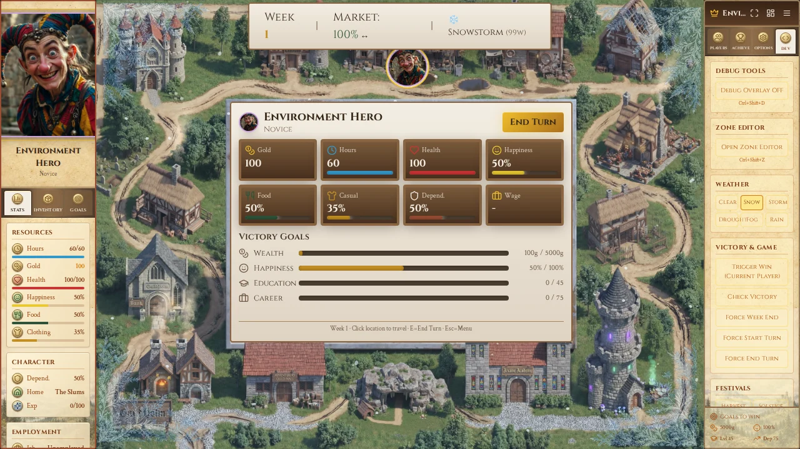
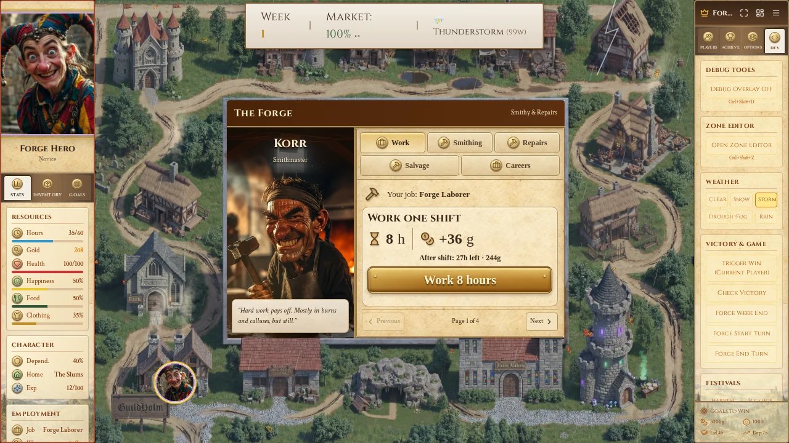
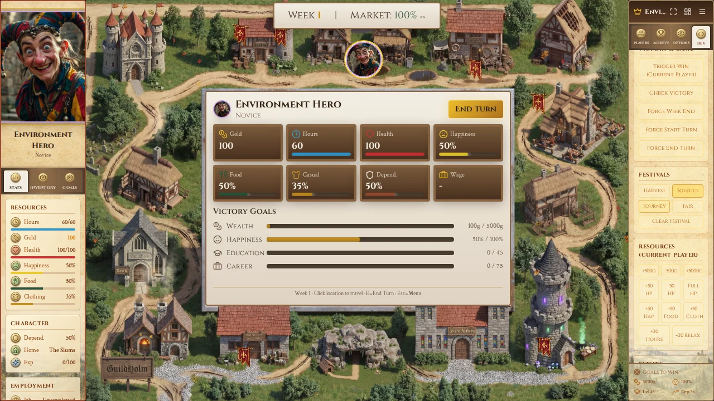
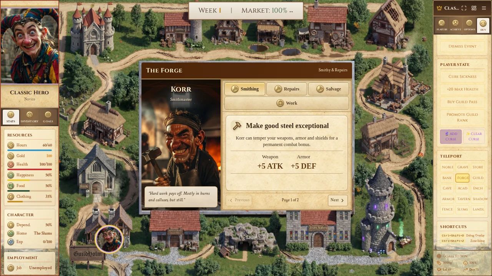

# Board VFX — verified runtime

Tested runtime: `61793ab77a70bcc4e54bbae5e78d1e2017d3a242`.
[Successful full CI run](https://github.com/Tombonator3000/guild-life-adventures/actions/runs/34176349430).
[Original PNGs and timing JSON](https://github.com/Tombonator3000/guild-life-adventures/actions/runs/34176349430/artifacts/10037466229).

The images below are **actual Chromium game captures**, exported to WebP without cropping or layout changes. They are not generated concepts. The final documentation commit changes no runtime code.

| Gate | Result | Evidence |
| --- | --- | --- |
| Board/figure identity | PASS | Original board hash and token/portrait/location files unchanged from the merged plan base |
| Required visual effects | PASS | Inspected clear, storm, snow, drought, tournament and mobile captures; shader reports `ready` |
| Gameplay and accessibility | PASS | 20 browser journeys: guided first turn, travel/banking, forge work/raise, Cave, menu pages, updates, online regressions, Full/Calm/Off and reduced motion |
| Transparent UI regions | PASS | Actual world/screen pixel alpha at the center panel is 0; tested bank actions remain clickable |
| Shared lifecycle | PASS | Manager tests cover one RAF, pause/resume without elapsed-time jump, static invalidation and cleanup; browser Calm clock stays still |
| Build/regressions | PASS | 733 tests across 92 files; production build, root TypeScript check, lint and audio audit pass |
| Extended app types | FAIL (existing baseline) | Exactly 185 pre-existing diagnostics; no added/removed normalized diagnostics. Root TypeScript config does not expose this existing debt |
| Short desktop frame sample | PASS for measured sample | 180 frames during storm in CI Chromium/dev: **59.34 fps average**, **16.8 ms p95/p99**; actual canvas pixels changed |
| Physical S24 / sustained 60 fps | UNVERIFIED | Mobile viewports and budgets were tested, not physical-device performance or long-session stability |

## Snow / edge frost

## Storm / playable forge

## Tournament

## Icons / sidebar materials

Mobile captures at 390 × 844 and 844 × 390 are in the linked original artifact, including snow, heat, bank actions and static Calm mode. See [timing data](vfx-frame-timing.json) and [implementation audit](../../AUDIT_LOG_BOARD_VFX_IMPLEMENTATION.md) for the review/correction history.
